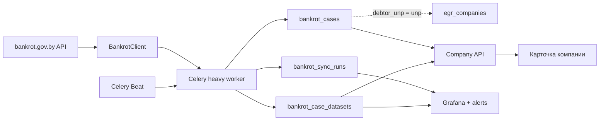

# Отчёт о развитии сервиса к 20 июля 2026

## Executive summary

За период отсутствия лида собран полноценный production-контур данных о банкротстве:
от устойчивой загрузки внешнего API до связи с ЕГР, пользовательского интерфейса,
истории изменений, мониторинга и эксплуатационной документации.

Результат — не разовый парсер, а повторяемый и наблюдаемый источник данных, который:

- ежедневно синхронизируется через Celery;
- покрывает основную карточку и 22 типа дочерних данных;
- связывает дела с `egr_companies` по УНП;
- сохраняет сырые JSON без потери новых полей внешнего API;
- не теряет последний успешный payload при временных ошибках;
- показывает полные сведения в карточке компании;
- открывает данные компаний для чтения без служебного `X-API-Key`;
- формирует в Telegram полное досье по всем источникам только по команде `/more`, не раздувая обычные алерты;
- измеряет полноту и качество каждого запуска;
- автоматически сигнализирует о деградации.

## Было / стало

| Область | Было | Стало |
| --- | --- | --- |
| Данные | список, карточка, судебные решения | имущество, оценки, продажи, кредиторы, публикации, планы, счета, кошельки, управляющие |
| Хранение | три JSON-поля дела | отдельное версионируемое хранилище наборов с upsert |
| Связь с ЕГР | отдельный источник | мягкая привязка по УНП и API-досье компании |
| Надёжность | ошибка endpoint могла обеднить запуск | изоляция ошибок, retry только исправимых сбоев, сохранение последнего успешного JSON |
| Авторизация | короткоживущий access token | refresh-token flow и повторная авторизация |
| Доступ к API | служебный ключ требовался даже для чтения карточки | публичные GET; `X-API-Key` только для sync/reindex/parse и `force_refresh` |
| Интерфейс | краткая строка о деле | ленивое раскрытие полного реестрового досье |
| Наблюдаемость | логи воркера | журнал запусков, расширенные метрики, Grafana и алерты |
| Эксплуатация | ручные команды | runbook и единый health-check |

## Архитектура

## Какие данные добавлены

- основные сведения дела и история процедур;
- судебные решения и документы;
- имущество, отчёты и оценка;
- продажи, аукционы и прямая реализация;
- собрания и комитеты кредиторов;
- требования кредиторов;
- списание и передача имущества;
- планы санации/ликвидации и отчёты по средствам;
- публичные объявления должника;
- счета и электронные кошельки должника;
- профиль, аккредитация, образование, документы, счета и дела управляющего.

## Надёжность

Закрыты реальные production-проблемы:

1. Восстановлен обязательный контракт `POST /cases`: полный набор фильтров и числовая сортировка.
2. Убраны повторы для HTTP 400/404: повторяются только потенциально исправимые ошибки.
3. Кабинетный `/messages/all`, требующий `ManagerId`, заменён публичным `/messages`.
4. Дочерние endpoint изолированы: один сбой не останавливает дело и весь запуск.
5. Повторная синхронизация идемпотентна.
6. При сбое новый `NULL` не затирает последний успешный JSON.
7. Данные управляющих и должников кэшируются в пределах запуска и не запрашиваются повторно.

## Измеримые показатели

Каждый запуск теперь сохраняет:

- обработанные и ошибочные дела;
- активные, закрытые и дела с неизвестным статусом;
- количество дел с УНП и процент покрытия;
- уникальных должников и управляющих;
- успешные и ошибочные дочерние наборы;
- процент успешных наборов;
- длительность запуска.

Актуальные значения перед встречей посмотреть в Grafana.

## Мониторинг

Новый Grafana-дашборд **Bankrot.gov.by — полнота и качество** показывает:

- объём реестра и активные дела;
- фактическую связь с ЕГР по УНП;
- свежесть последнего успешного запуска;
- длительность и динамику запусков;
- качество дочерних наборов;
- ошибки в разрезе типов данных.

Добавлены алерты:

- последний запуск завершился ошибкой;
- успешного обновления нет более 48 часов;
- качество дочерних наборов ниже 95%.

## Сценарий демонстрации на 7 минут

1. **Карточка компании:** показать краткое дело и раскрыть полное досье.
2. **Глубина данных:** открыть имущество, продажи, требования, публикации и управляющего.
3. **Связь источников:** показать, что дело найдено через УНП компании ЕГР.
4. **Grafana:** показать покрытие, свежесть, успешность наборов и историю запусков.
5. **Отказоустойчивость:** объяснить изоляцию endpoint и сохранение последнего успешного JSON.
6. **Эксплуатация:** показать метрики последней синхронизации в Grafana.

## Проверки перед показом

- [ ] `alembic current` показывает head.
- [ ] `egr-celery-worker-heavy` и `egr-celery-beat` работают.
- [ ] Последний `bankrot_sync_runs.status = done`.
- [ ] `dataset_success_pct >= 95`.
- [ ] Grafana-дашборд загружен и не содержит `No data`.
- [ ] В UI найдена компания с несколькими непустыми наборами.
- [ ] Токен не присутствует в Git и логах отчёта.

## Следующий этап

- нормализовать наиболее востребованные сущности имущества и требований для аналитических запросов;
- добавить сравнение изменений дочерних наборов между запусками;
- построить риск-сигналы по новым делам и смене процедуры;
- добавить адресную загрузку бинарных документов по запросу пользователя.
